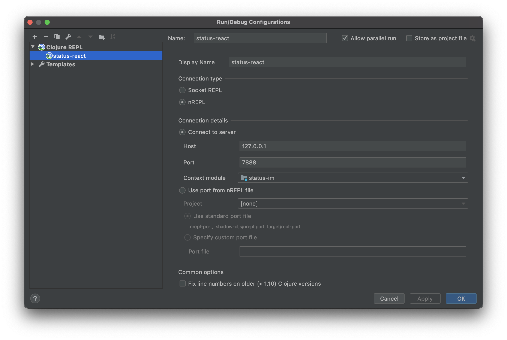

# Using IntelliJ IDEA and Cursive

## Table of Contents

- [Install Cursive](#install-cursive)
- [Getting Cursive to understand `status-react`](#getting-cursive-to-understand-status-react)
- [I get a lot of `cannot be resolved`](#i-get-a-lot-of-cannot-be-resolved)
- [REPL!](#repl)
  - [Connecting to REPL to IntelliJ](#connecting-to-repl-to-intellij)
  - [Connecting REPL and IntelliJ to `status-react`](#connecting-repl-and-intellij-to-status-react)

## Install Cursive

See https://cursive-ide.com/userguide/index.html

## Getting Cursive to understand `status-react`

- Add this file to the root of the `status-react` project dir
  - https://gist.github.com/Samyoul/f71a0593ba7a12d24dd0d5ef986ebbec
- Right click and "add as leiningen project"


## I get a lot of `cannot be resolved`

Are you getting problems where you get a lot of `cannot be resolved` on everything?


See https://cursive-ide.com/userguide/macros.html

- opt+enter (on macOS)
- resolve defview as fn and letsubs as let
- move selection on resolve and hit enter
- and select defn for defview and let for letsubs

## REPL!

### Connecting to REPL to IntelliJ

I had a number of problems connecting to REPL, the solution is as follows:

At the top of IntelliJ IDEA click on the `Add Configuration...` option:


This will load the following menu:


Click on the `+` icon in the top left corner of the menu.

Select `Clojure REPL > Remote`


Which will load the following menu


Enter the below options:

- Name = status-react
- Display Name = status-react
- Connection type = nREPL
- Connection details
  - Host = 127.0.0.1
  - Port = 7888



Press `OK`

Now the below option will be visible.
Press the green run button


You should now see an dialog with the following message:

```shell
Connecting to remote nREPL server...
Clojure 1.10.1
```

To confirm you have a working connection with REPL enter the following command in the input box below the output:

```shell
(prn 1)
```

Which should output

```shell
(prn 1)
1
=> nil
```

See below:


### Connecting REPL and IntelliJ to `status-react`

**The important next step is telling REPL the context in which to interact with the code.**

Do the following:

Ensure you have 3 terminals running the following

- `make run-clojure`
- `make run-metro`
- `make run-ios` / `make run-android`

[See the STARTING GUIDE for details](STARTING_GUIDE.md#development)

Next go back to the REPL input and enter the following commands:

```clojure
(shadow/watch :mobile)
(shadow/repl :mobile)
```

See Below


Which should switch the clj file type target to cljs as shown above

Finally you are ready to test REPL.

Create a sample function to evaluate something simple like `(prn "I'm working")`, move your cursor to one of the outer parentheses. Right or `control` click and select the `REPL` option. From there select `Sync files in REPL` and then `Send '...' to REPL'`.


Alternatively you can use the shortcut commands `⇧⌘M` to sync your files and `⇧⌘P` to send the statement to REPL. You may also need to switch the REPL namespace to match the current file, which can be done manually from the dialogue box or using the `⇧⌘N` shortcut key.

Following the above should give you the below result:


🎉 Tada! Working! 🎉

---

For additional details on issues you may face when setting up REPL with Cursive [see this document](https://notes.status.im/9Gr7kqF8SzC_SmYK0eB7uQ?view#Connecting-Cursive--IntelliJ-IDEA-to-REPL-Problems)