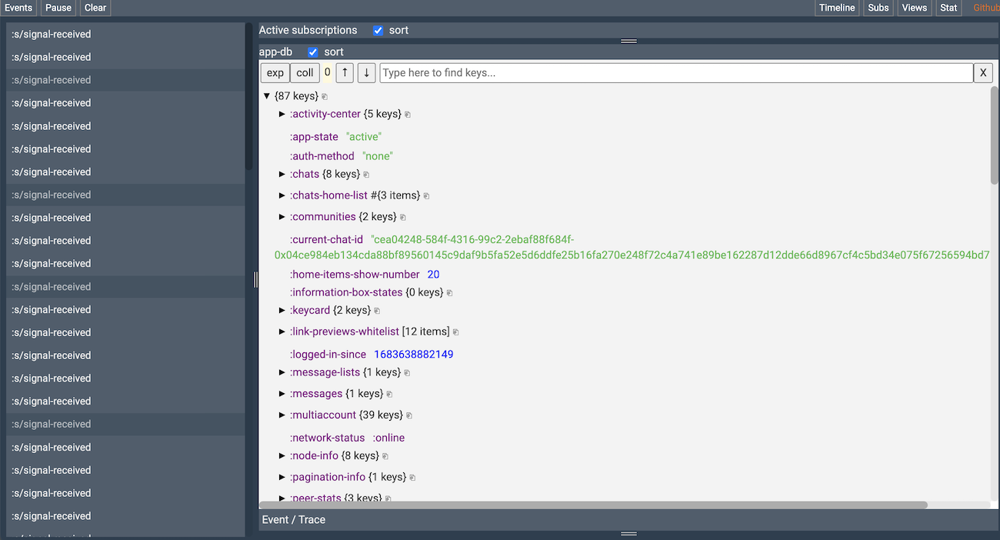

# Debugging

## Inspecting re-frame with re-frisk
`re-frisk` is a state visualization tool written by our very own Andrey (@flexsurfer). With its help you can inspect the current state of app-db, watch event, etc.



To start `re-frisk`, execute the following command:
```bash
$ yarn shadow-cljs run re-frisk-remote.core/start
```

or you can also use make:

```bash
$ make run-re-frisk
```

A server will be started at http://localhost:4567. It might show "not connected" at first. Don't worry and just start using the app. The events and state will populate.

More details about re-frisk are on the [project page](https://github.com/flexsurfer/re-frisk).

## Enabling debug logs
Calls to `log/debug` will not be printed to the console by default. It can be enabled under "Advanced settings" in the app:


## Checking status-go logs
While status mobile works it saves logs from `status-go` to `geth.log` file.


### Checking logs from physical device
To obtain `geth.log` from physical device you need to shake it and in an opened menu select "Share logs". 


### Checking logs from iOS Simulator
When developing with iOS simulator it is more convenient to see the `geth.log` updates in real-time.
To do this:
- open Activity Monitor
- find the "StatusIm" app and doubleclick it
- in the opened window select "Open files and ports" and find the full path to `geth.log` (note that it won't appear until you login to Status app)


