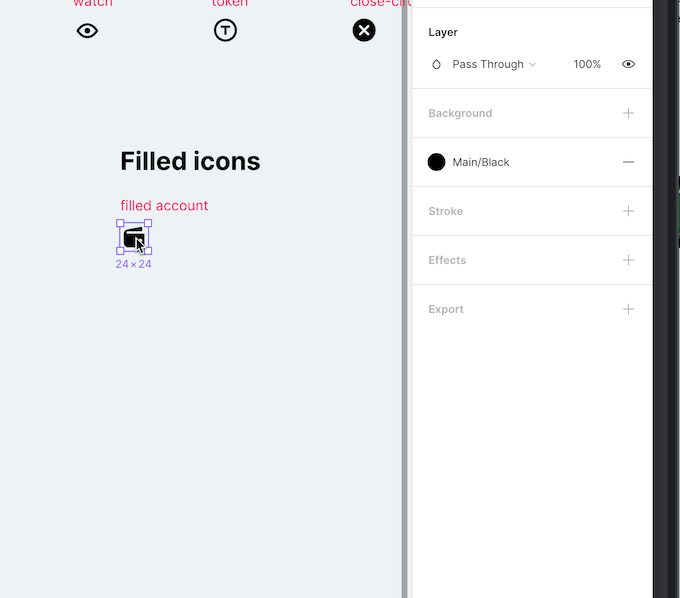

# new icons

## Export icons



1. Export from figma 2 pngs 2x and 3x put them in `./resources/images/icons`
2. if necessary, rename file so that filename contains only lower case chars, e.g. `"Icon-Name@2x.png"` should be renamed to `"icon_name@2x.png"`.
3. In the app `icon_name.png` still can be accessed as `icon-name`, so in order to use can add the next code:
    ```clojure
    ;; icon_name.png
    [vector-icons/icon :icon-name {:color ...}] 
    ```
    2x@2x
4. If you want paltform specific icon use `.android` or `.ios` suffixes.  Example `icon_name@2x.android.png`.:w
