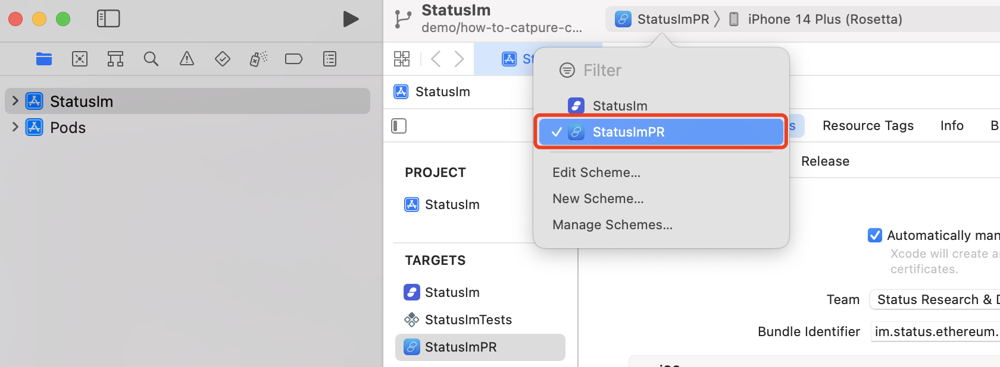
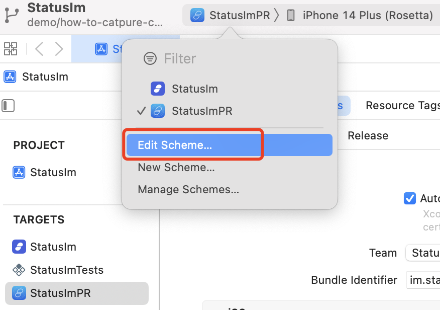
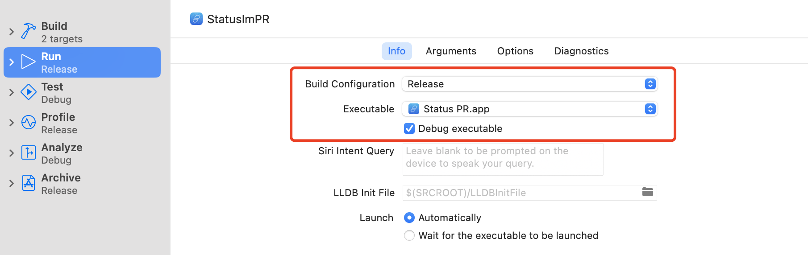
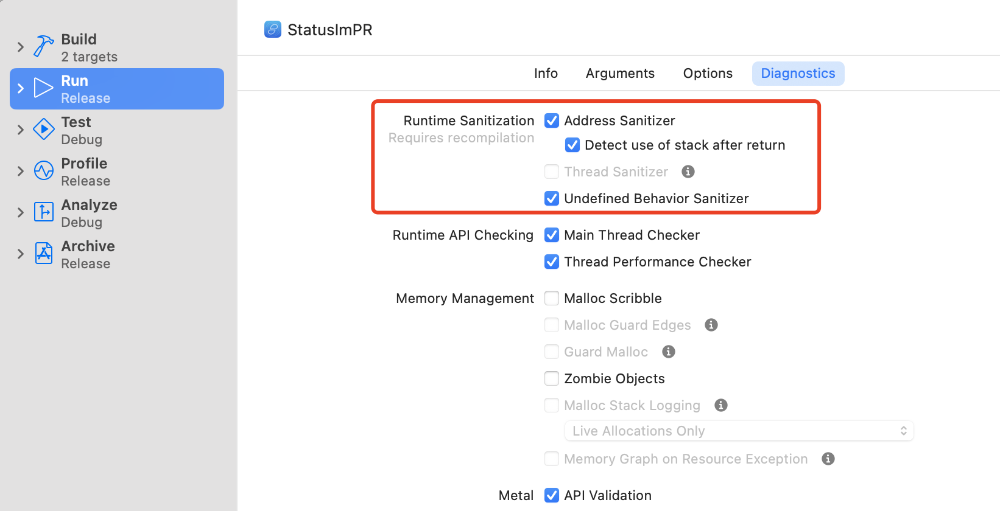
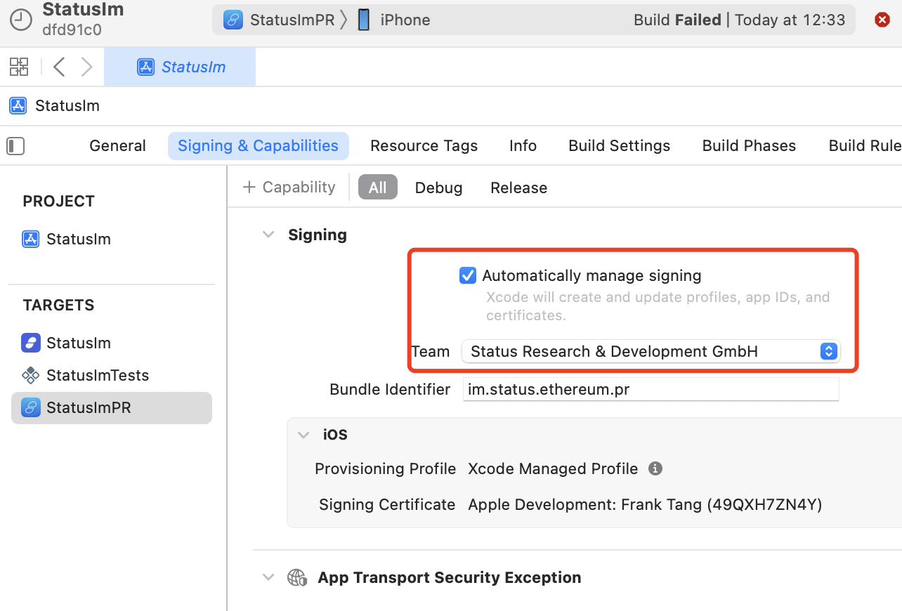
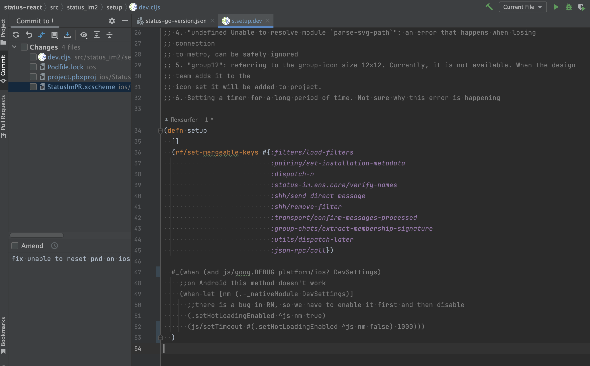
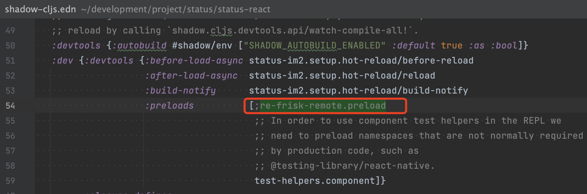
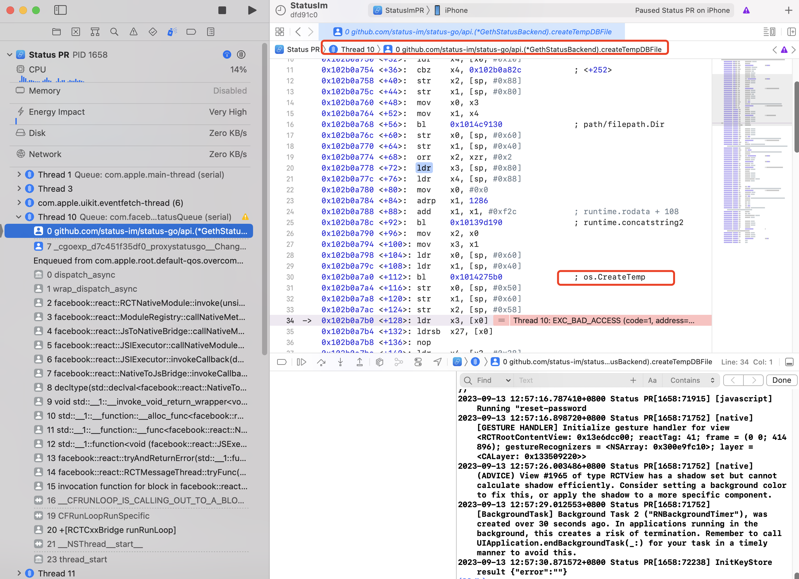
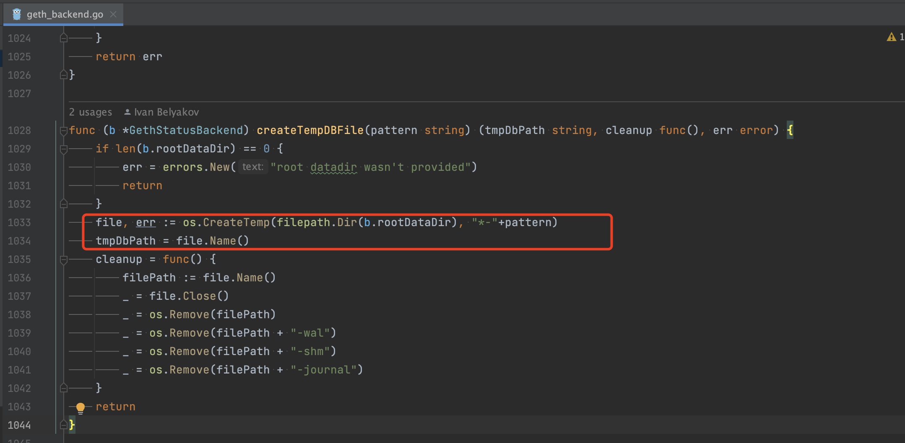

# How to catch crash on ios use xcode

## Overview
Sometimes, we can't reproduce crash with local dev build, probably because your built version differs from the one QA team used. 
The QA team mostly used the PR build version. In this guide we will try to make a build as close as possible to the PR build for iOS.

You may notice various configuration files starting with .env (such as .env, .env.e2e, .env.jenkins) in the project. 
The usage of these files and environment variables injected at build time on CI will not be covered in this guide.

This guide covers how to configure Xcode to capture a crash stack trace with a physical iOS device. This allows debugging crashes by inspecting the stack trace.
I will use [issue #17255](https://github.com/status-im/status-mobile/issues/17255) as an example to reproduce and analyze a crash.

## Prerequisites
- A physical ios device (simulator is not considered in this doc)
- Xcode installed
               
## Steps
1. Prepare Status Mobile
   1. Open Terminal, cd to project root
   2. Run `make run-clojure` in one tab
   3. Run `make run-metro` in a second tab
   4. Run `make pod-install` in a third tab
2. Configure Xcode Project
   1. Open Xcode
   2. Open a project or file, navigate to folder `path_to_root_directory_of_status_mobile/ios` 
   3. Set Scheme `StatusImPR` as current scheme 
   4. Edit scheme 
   5. Change `Info` 
   6. Change `Diagnostics` 
   7. Set automatically manage signing 
3. Update Code
   1. Edit `src/status_im2/setup/dev.cljs`, comment out lines 47-52 
   2. Edit `shadow-cljs.edn`, comment out `re-frisk-remote.preload`, otherwise it will try to connect `localhost:4567` on physical device which could slow down performance 
4. Reproduce Crash And Analyze
   1. Choose your physical ios device as target device and Run 
   2. Follow reproduce steps from [issue #17255](https://github.com/status-im/status-mobile/issues/17255) mentioned and xcode will halt at crash point 
   3. Inspect stack trace to identify root cause. From the stack trace, we can locate the crash happened in `api/geth_backend.go:1048`(createTempDBFile) clearly! 

## Links
- [changes](https://github.com/status-im/status-mobile/commit/4306d419de15e737e8ded3a749cc5e8d6a06e627) to source code
