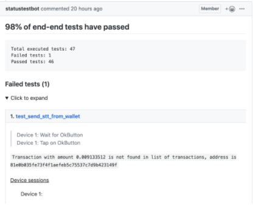
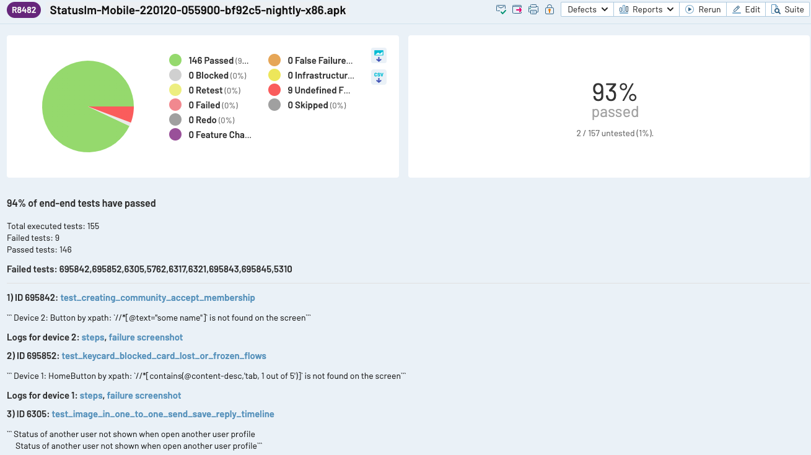
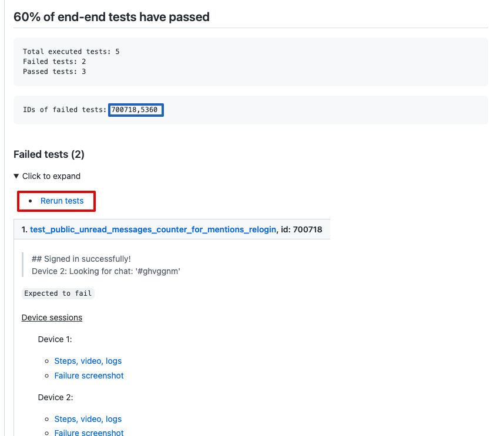
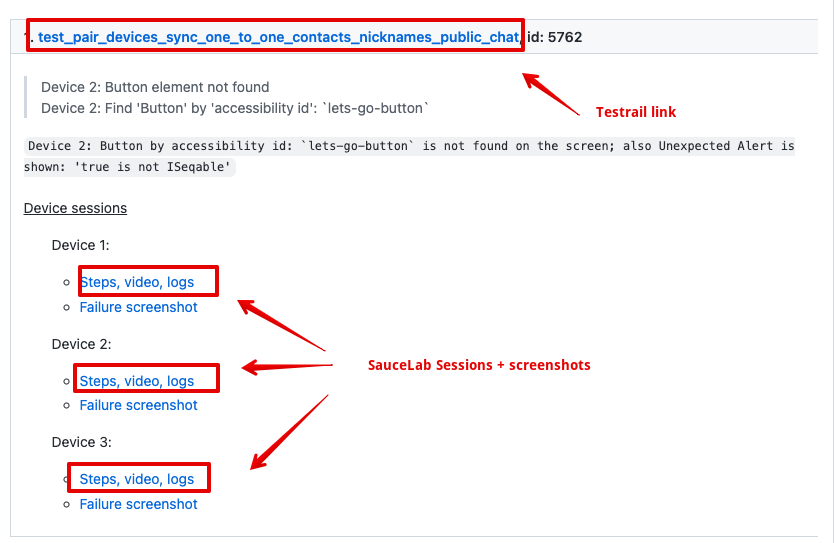

How to Launch E2E
===

## Overview for how automated test structured for Status app

As a part of CI for Status mobile app and in order to ensure there are no regressions appear after the changes in code (bug fix, new/updated feature) we are using automated tests (e2e tests).

- Automated tests written on Python 3.9 and pytest.
- Appium (server) and Selenium WebDriver (protocol) are the base of test automation framework.

TestRail is a test case management system tool where we have test cases. 

Each of the test case gets a priority (Critical/High/Medium)

**SauceLabs** - is a cloud based mobile application test platform. We are using Android emulators (Android 10.0) for test script execution there. We have 16 session be running at the same time max.
For now we support e2e for Android only.

## What's happening when any e2e job is running
Whenever we need to push set of test scripts we create 16 parallel sessions (max, but depending on amount of cases that are included in job) and each thread: 1) uploads Android .apk file to SauceLabs -> 2) runs through the test steps -> 3) receives results whether test failed on particular step or succeeded with no errors -> 3) Parse test results and push them as a Github comment (if the suite ran against respective PR) and into TestRail.

We push **whole automation test suite (currently 155, amout is changing)** against each nightly build (if the nightly builds job succeeded). Results of the test run are saved in TestRail.
And also we push set of autotests whenever PR with successful builds got moved in to `E2E Tests` column from [Pipeline for QA dashboard ](https://github.com/status-im/status-react/projects/7). 
In that case we save results in TestRail as well and push a comment with test results in a respective PR.

For example: https://github.com/status-im/status-react/pull/9147#issuecomment-540008770

The test_send_stt_from_wallet opens link in TestRail https://ethstatus.testrail.net/index.php?/tests/view/890885 where performed steps could be found
List of all runs performed by test jobs could be found here https://ethstatus.testrail.net/index.php?/runs/overview/14 

**For credentials for TestRail to see results ping Chu in DM**:

Opening any test run navigates you to list of test cases with results:

## What about launching e2e manually

To manage e2e there are several jobs in https://ci.status.im/job/status-mobile/job/e2e :
1) [nightly](https://ci.status.im/job/status-mobile/job/e2e/job/status-app-nightly/) - running automatically after building nightly apk e2e build. QA running it manually for results of e2e when testing release.
2) [upgrade](https://ci.status.im/job/status-mobile/job/e2e/job/status-app-upgrade/) - running manually by QA in release testing for smoke upgrade tests.
3) [prs](https://ci.status.im/job/status-mobile/job/e2e/job/status-app-prs/) - running **only automatically** when PR moves into `e2e column`
4) [prs-rerun](https://ci.status.im/job/status-mobile/job/e2e/job/status-app-prs-rerun/) - for manual run, can be run on request by anyone. **If you need to launch e2e against your build, use this job.**
Params to specify:

- apk: [url_to_apk_build_here]
- pr_id: pull request number (e.g. 1234)
- branch: branch name from which the test are taken (in most of cases `develop`)
- keyword expression: tests by area (let's say `ens` or `chat`, thay can be combined`ens or chat or send_tx`. All keywords can be found in testrail, ping Chu for details)
- test_marks: tests by priorities (by default: `critical or high or medium`, which corresponds the whole suite; to lauch the same suite as in PRs, use `critical or high`)
- testrail_case_id: here is the list of test cases which you may find in test rail (4-digit value)

For easier access you can hit `Rerun tests` in GH comment and testrail_case_id/ apk_name/ pr_id  will be filled automatically. For making sure that tests are being rerun on most recent e2e build it is recommended to paste link to the last e2e build in apk_name field. The list of PR builds can be found in Jenkins Builds block on PR page. 
 
And then hit ‘Build’.
Once the job starts it picks up specified tests, runs them against provided apk and sends results to pull request.

Even we have 16 parallel sessions for testing it’s a time consuming operation (whole test suite we have automated at the moment takes ~140 minutes to finish). 
So for PRs we pick only set of `critical or high` (you can also use this in TEST_MARKS param for job)
tests (otherwise some PRs could wait their turn of the scheduled Jenkins job till the next day).

## Analysing test results (and why test fails to pass)

After automated test run finished test results could be found in GH comment (if the test suite ran agaist PR) and TestRail. There are two states of the test: Passed and Failed. Test failure happens when certain condition of test step has not met or automated test can not proceed execution because it can not find the respective element on screen it expects should be there.

Several examples of when test fails to succeed:

- Test clicked on element which should load new screen (or pop-up) and awaits some element on this screen. But test did not wait enough allowing the new screen to appear and so it fails with “Could not find element XYZ” (this case is more app issue in our opinion rather then test issue, but we just can not spend our and dev time with too specific random places which happens once causing app lags in different moments)

- Test sent transaction to address but it was not mined in time (we have a limit to wait until balance is changed on recipient side up to ~6 mins now). We classify this as False Fail, because it’s not the app issue but more network issue.

- Test infrastructure issues, - anything related to infrastructure including SauceLabs side issues (apk failed to install - rare case, or LTE connection was set by default instead WiFi or unexpected pop-up appeared preventing test to going further)

- Failure due to changed feature which has not been taken into account in some test after code merge (for instance: some element on screen has been removed, and we want to locate another element on this screen via XPath which is different now)

- **Valid issue in the automated test scripts** - that's what we're looking for

Example: here is the test results https://github.com/status-im/status-react/pull/13015#issuecomment-1016495043 where one test failed. 
    1. Open the test in TestRail and open session recorded for this test in SauceLabs

In TestRail you may find all the steps performed by the test.
In SauceLabs testrun page you may find useful: video of the session, step logs, logcat.log of the session
    2. Analyze step where test was failed
For particular example it was failed on `Recover access(password:qwerty, keycard:False)` and unexpected error appeared.

## Limits for e2e tests coverage
Not all features of the app could be covered by e2e at the moment:

- Colours or place of an element on UI.
- Real ETH/token transactions. That’s the main reason we have separate .apk build for automation needs - it defaults to Goerli network. Also it has enabled keycard test menu, ENS names and chat commands are also on Goerli network (the same in PR builds, but not in nightlies / release)
- Autologin/Biometric related actions (autologin available when device meets certain conditions like the it has set unlock password and device is not rooted: all emulators are rooted in SauceLabs)

## Brief flow for test to be automated

Whenever there is a need to have a new test:
1) Create a test scenario in TestRail. 
2) If certain item could be checked in scope of existing test case we update existing one (otherwise we may have thousands of test cases which is overkill to manage in TestRail as well as in automated test scripts). And also complex autotests increase probability to not catch regressions by stopping test execution (due to valid bug or changed feature) keeping the rest test steps uncovered. So here we need to balance when it makes sense to update existing test case with more checks.
3) Then we create test script based on the test case, ensure test passes for the build and pushing the changes to repo.
