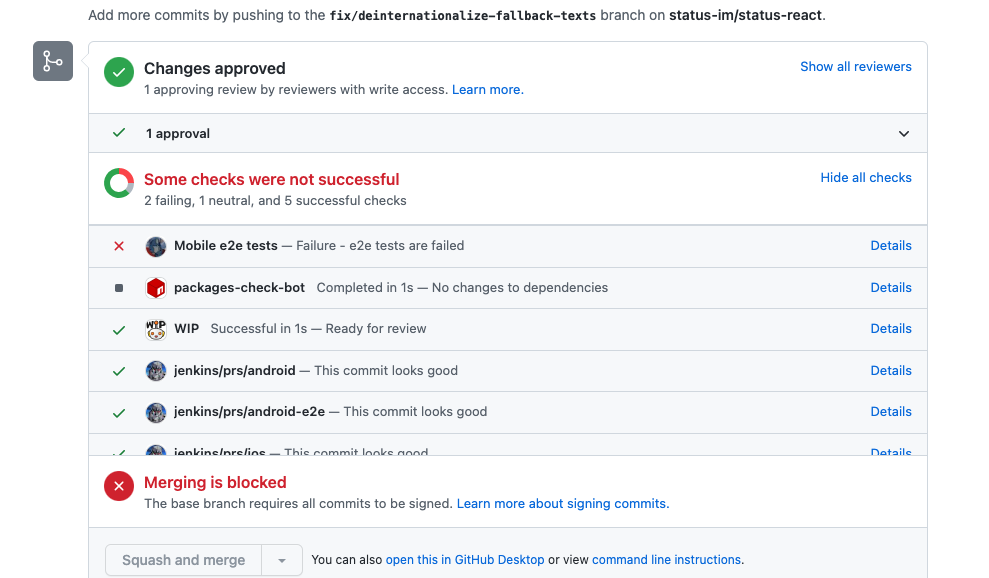

# Pipeline process

[Pipeline for QA](https://github.com/status-im/status-mobile/projects/7) is a project board for developers and testers used to track the status of a pull request, get reviews and manual testing, and run autotests.

The generally accepted recommendations for its use are described below:

## Opening a PR
- Once a PR is created, it moves to the ```REVIEW``` column where a review will be requested automatically.
- You can also request a review inside the PR from a particular person if needed.
- When creating a PR, do not forget to assign it to yourself.
- Also in case the PR adds new functionality, a short description would be appreciated.

### What if the work is still in progress?

- If PR work is not finished yet, please mark it as a draft or add [WIP] to the title and keep it in the `CONTRIBUTOR` column until it's ready to be reviewed/tested.


### When is a PR considered to be Ready for testing by QA team? 


Ready for testing PR should meet the following criteria: 

1. Reviewed and has at least 1 approval
2. Rebased to `develop` branch (both `status-mobile` and `status-go` if needed, depending on what part has changes) 
3. All possible conflicts have been resolved 
4. Has the label: `request-manual-qa`

**From the perspective of a developer it means that once work on PR is finished:**

1. It should be rebased to the latest `develop`. If there are conflicts - they should be resolved if possible.
2. If the PR was in the `Contributor` column - it should be moved to `Review` column.
3. Wait for the review.
4. Make sure that after review and before requesting manual QA your PR is rebased to current develop.
5. Once the PR has been approved by reviewer(s) - label `request-manual-qa` should be applied to the PR
6. Move PR to the E2E column when it is ready for testing (**mandatory for all PRs**). That will also trigger e2e tests run. QAs are monitoring PRs from E2E column and take it into test. 

After that - PR will be taken into manual testing by the QA team.

## Testing PR

### Manual testing
- If you think PR needs and is ready for manual testing, please add the ```request-manual-qa``` label. 
- QA engineer picks up one of PRs with the ```request-manual-qa``` label, drags the item to the ```IN TESTING``` column and assigns it to themselves.
- During testing, QA will add comments describing the issues found, and also review automation tests results.
Usually found issues are numbered as "Issue 1, Issue 2", etc.
When the first round of testing is completed and all issues for this stage are found, the QA can add the ```Tested - Issues``` label and drag the card to the ```CONTRIBUTOR``` column. These two actions are optional.
- When manual testing of the PR is fully completed and all the issues are fixed, the QA adds the ```Tested - OK``` label and drags the card to the ```Design review``` column (the cases when design review is necessary are described below).
- If design review is not required, the QA drags the PR to the ```MERGE``` column. After that the developer merges PR into develop.
- If design review has been done, the designer (```@Francesca-G```) drags the PR to the ```MERGE``` column.
After that the developer merges PR into develop.
- If manual testing/design review was not carried out, the developer drags PR to the ```MERGE``` column themselves.

### Design review
_**How do I know if a design review is needed?**_

There are three cases here depending on the changes in the PR:
1. **Functional PRs with UI changes:** after the ```Tested - OK``` label is added, the QA moves the PR to the ```Design review``` column + mentions ```@Francesca-G``` in comments. 
2. **Component PRs:** once the PR has received a review from developers and e2e tests results, it can be moved directly to the ```Design review``` column by the developer (manual testing step can be skipped) + the developer mentions ```@Francesca-G``` in comments.
3. **Functional PRs changes in which are not related to UI (e.g. a crash fix):** skip the ```Design review``` step (the PR should only be manually tested by QA).

There are three possible scenarios when the design review is completed:
1. **Approved by design**  > the PR is moved to the ```MERGE``` column by Francesca
2. **Some changes requested, but can be fixed as followups** > need to be negotiated with Francesca  > Francesca moves PR to the ```MERGE``` column and adds the ```Follow-up required``` label >  follow-ups should be added **by the dev** right after the PR is merged
3. **Some changes requested, they should be fixed before merge** > Francesca reviews the PR again after the fixes and moves PR to the ```MERGE``` column from ```Design review```

---
**Notes:**
- If your PR has a long story and started from `develop` branch several days ago, please rebase it to current develop before adding label
- if PR can be tested by developer (in case of small changes) and/or developer is sure that the changes made cannot introduce a regression, then PR can be merged without manual testing. Also, currently, PRs are not manually tested if the changes relate only the design (creation of components, etc.) and do not affect the functionality.
---        

#### Why my PR is in `Contributor` column?
PR can be moved to this column by the ```status-github-bot``` or by QA engineer with label `Tested-issues`.
In the first case most often this happens due to conflicting files in PR.
In the second case - after fixing of all found issues, the developer should ping the QA in the PR comments for retesting.

## Merging a PR
**Merge conditions:**
1. Required number of reviews received
2. E2E results are received and reviewed
3. All commits are squashed into one.
4. No conflicting files in PR
5. No issues from lint
6. Pay attention to automation checks (some of them are not blockers, best to check before merge anyway)



6. In case of manual testing - the label ```Tested - OK``` from QA
7. In case of design review - the approval from the designer


You can merge your PR into develop - some useful clues you can find [here](https://notes.status.im/setup-e2e#3-Merging-PR) 

HAPPY DEVELOPMENT! :tada: 
