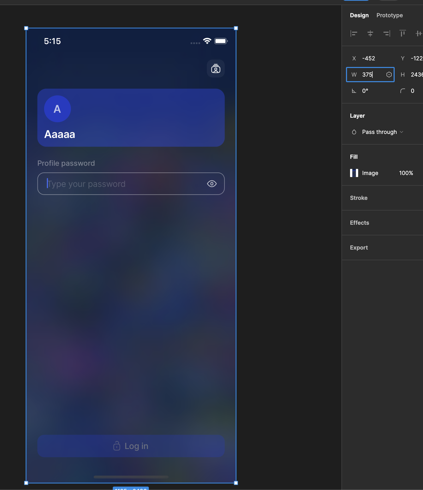

# Pixel Perfection
The Status Mobile team aims to align the design implementation perfectly according to a given screens respective Figma design spec.

Currently the Figma Designs match up with an "iPhone 11 Pro" screen size. 

To test your implementation is correct you can take the following steps

- Open a new Figma file so that you have write privileges. 
- Copy in the component or screen from the Figma file.

- Using the "iPhone 11 Pro" simulator (it is the default now) you take a screen shot of your component and paste it into your Figma file.

- To get the right size, set your screenshot to width 375px

- Lower the opacity so you can see it sitting on top of the Figma mock ups. 
