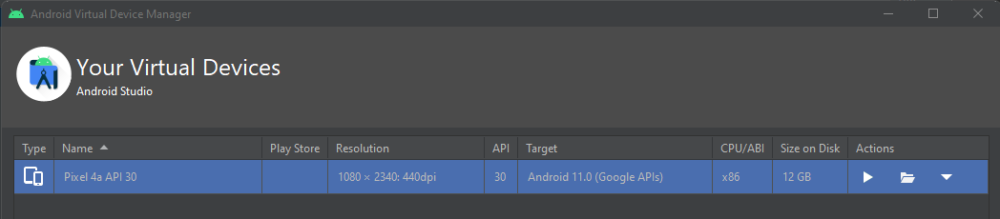

### Setting up status-mobile on Windows

Note: It is far easier to dual boot your Windows OS with any linux Distro.
(Preferably `Ubuntu` if you're new to Linux)
However if you still wish to get status-mobile repository set up on a Windows OS,
below are the instructions: 

#### Step 1: WSL2 (Windows SubSystem for Linux)
At a high level, `WSL2` is basically running as a `VM` on `Windows OS` with its own 
networking stack that is connected to a private (virtual) network where `Windows OS` 
acts as the gateway.

To check your installed version of WSL execute this command in powershell:

`wsl -l -v`

If you see any linux distro as an output with version 2 you are good to 
skip this step. Else you will have to install `WSL2`, use the following command
in powershell which was "Run as Administrator" :

`wsl --install`

reference : https://learn.microsoft.com/de-de/windows/wsl/install#install-wsl-command

#### Step 2: Get the status-mobile repository inside WSL2

If you newly installed WSL2 and followed the setup till the end your existing powershell
terminal would automatically log you into the WSL2 Linux Distro (Could be Ubuntu in your case).

Otherwise you can open a WSL2 terminal by pressing the window key and typing "wsl"

Once inside a wsl terminal decide where you want to clone status-mobile's repository and 
cd into that directory and run :

`git clone https://github.com/status-im/status-mobile.git`


#### Step 3: Running the clojure terminal
`cd status-mobile`

Once inside the cloned repository you should run this command :

`make run-clojure`

#### What does it do?
This command will install nix and nix will then install all the necessary 
dependencies, once that is done. This command will run `shadow-cljs` and compile the
`clojurescript` code and then start a hot reloading server.
note : This might take a while

wait till you see something like this : 

```log
[:mobile] Build completed. (1337 files, 1335 compiled, 0 warnings, 573.69s)
```

#### Your freshly installed Linux Distro might not have make
In case of Ubuntu
`sudo apt install make` should be all that's needed to install `make`

#### Step 4: Running the metro terminal
In a new terminal tab run the following command :
`make run-metro`

#### What does it do?
This command first configures a nix shell with target `clojure` and then it runs the
metro server which react-native needs.

After it succeeds you should see something like this :


#### Step 6: Set up WSA (Windows Subsystem for Android)
ref : https://learn.microsoft.com/en-us/windows/android/wsa/

Windows Subsystem for Android is available on **Windows 11.** 
Your device must meet specific requirements: 
https://support.microsoft.com/en-gb/windows/install-mobile-apps-and-the-amazon-appstore-on-windows-f8d0abb5-44ad-47d8-b9fb-ad6b1459ff6c

A pre-requisite of WSA is to Download Amazon App Store which is only available for the following countries :
https://support.microsoft.com/en-gb/windows/countries-and-regions-that-support-amazon-appstore-on-windows-d8dd17c7-5994-4187-9527-ddb076f9493e?preview=true

You can change your Region in settings and the restart your microsoft store and then search "amazon app store"
This will allow you to proceed further.


#### Step 5: Building and running on Android Emulator
Open your Desired Android Emulator and make sure it has booted up.

Then in a new terminal tab run the following command :
`make run-android`


//TODO : refactor below part once you verify makefile changes

There are several different apps in the development stack that need to be coordinated. 
Namely, `ADB`, `Shadow-CLJS`, and `React Metro`.
This guide is going to combine tips from 
https://gist.github.com/bergmannjg/461958db03c6ae41a66d264ae6504ade#enable-access-to-adb-server-from-wsl2
And
https://stackoverflow.com/a/45522559
First, we assume you’ve downloaded `Android Studio` and setup an appropriately recent `AVD`. 
I’m using `API 30` on an `x86 ABI`. 



You’ll want to have a batch script to launch the emulator, so you don’t need to have `Android Studio` open. 
That, and you need to run `ADB` from the CLI independent of `Android Studio`, so you wouldn’t want to launch it 
from `Android Studio` anyway. From https://stackoverflow.com/a/45522559 CC BY-SA 4.0:
You can make a batch file, that will open your emulator directly without opening `Android Studio`. 

If you are using Windows:

- Open Notepad
- New file
- Copy the next lines into your file:
- `cd /d C:\Users\%username%\AppData\Local\Android\sdk\tools`
- `emulator @[YOUR_EMULATOR_DEVICE_NAME]`

Notes:
- Replace `[YOUR_EMULATOR_DEVICE_NAME]` with the device name you created in emulator
- To get the device name go to: `C:\Users\%username%\AppData\Local\Android\sdk\tools`
- Run cmd and type: `emulator -list-avds`
- Copy the device name and paste it in the batch file
- Save the file as `emulator.bat` and close
- Now double-click on `emulator.bat`, and you got the emulator running!

You will also need to run an `ADB daemon` on `Windows` that runs in the foreground and listens on all addresses. 
From https://gist.github.com/bergmannjg/461958db03c6ae41a66d264ae6504ade#enable-access-to-adb-server-from-wsl2:

- `adb kill-server`
- `adb -a nodaemon server start`

Approve `ADB` to bypass firewall rules, as applicable.
Next, boot up `WSL2` and cd into your local copy of status-mobile’s git repo.

For the following steps, I recommend using a terminal multiplexer like TMUX or Screen. 
We are going to start 5 different ttys, and then one more Windows CMD 
(at this point we already have two Windows CMDs from launching the emulator and ADB), 
so at a high level, here’s the outline of what we have left to do:

- terminal 1 = set shadow host and run the `clojure`
- terminal 2 = `re-frisk debugger`
- terminal 3 = `metro`
- terminal 4 = `run socat`
- terminal 5 = `run-android`
- on windows = `portforward` 8081 to 12

In terminal 1, we need to set an environment variable SHADOW_HOST and set it to WSL2’s ip address. 
You can get it from `ip addr` or just try the following:

- `export WSL_HOST=$(tail -1 /etc/resolv.conf | cut -d' ' -f2`
- `export SHADOW_HOST=${WSL_HOST}`
- `make run-clojure`

This will ensure the Metro app running on the emulator will pingback to our shadow-cljs server, 
here’s where that envvar goes if you’re curious: 
https://github.com/status-im/status-mobile/blob/e260187cf5d800e5af2ab5614ca67c6ae1faccfe/shadow-cljs.edn#L73

In terminal 2, run the re-frisk debugger, nothing different from the standard Status developer guide here. 
You can skip this if you don’t need a CLJS debug server.
- `make run-re-frisk`

In terminal 3, run metro, again nothing different here.
- `make run-metro`

In terminal 4, we are going to do things a bit different. We aren’t going to run-android just yet.
We are going to run socat per the already cited gist 
[https://gist.github.com/bergmannjg/461958db03c6ae41a66d264ae6504ade#enable-access-to-adb-server-from-wsl2] 
(go apt-get install it if you haven’t already). 
Unfortunately, the ADB_SERVER_SOCKET method may look like it works when you run adb from within a nix shell, 
but gradle appears to ignore these envvars, 
so packet-forwarding is the way to go:
`socat -d -d TCP-LISTEN:5037,reuseaddr,fork TCP:$(cat /etc/resolv.conf | tail -n1 | cut -d " " -f 2):5037`

Now one more thing before we actually go run-android, we need to forward the Metro 8081 port to our WSL2 VM, 
on Windows CMD use the following incantation stolen from the aforementioned gist:
- `iex "netsh interface portproxy delete v4tov4 listenport=8081 listenaddress=127.0.0.1" | out-null;`
- `$WSL_CLIENT = bash.exe -c "ifconfig eth0 | grep 'inet '";`
- `$WSL_CLIENT -match '\d{1,3}\.\d{1,3}\.\d{1,3}\.\d{1,3}';`
- `$WSL_CLIENT = $matches[0];`
- `iex "netsh interface portproxy add v4tov4 listenport=8081 listenaddress=127.0.0.1`
- `connectport=8081 connectaddress=$WSL_CLIENT"`

Finally, we can go ahead and run-android in terminal 5:
`make run-android`

