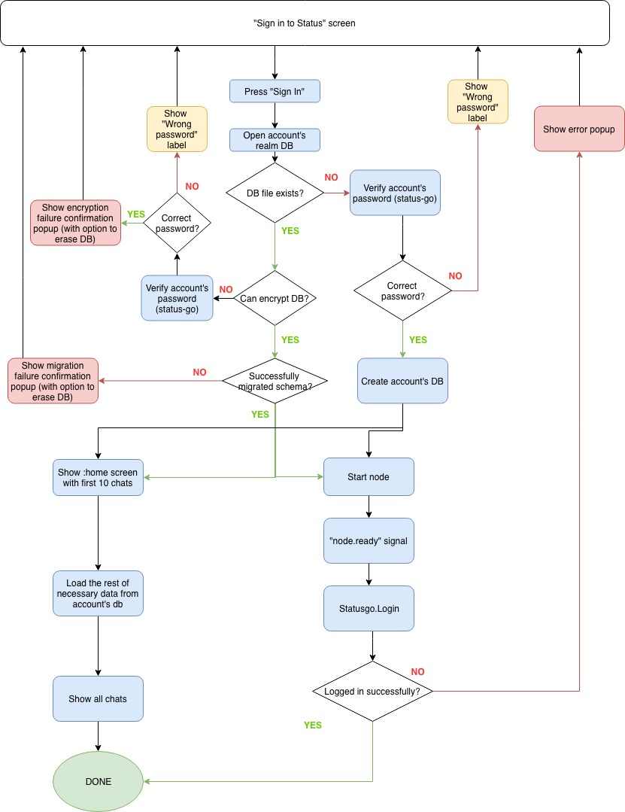

# Sign in flow

TODO: this document is outdated

## tl;dr 
In general, at first we try to encrypt realm database using password 
and then proceed with the rest of operations. We do not wait for 
`Statusgo.Login` callback in order to show `:home` screen with chats
as this call may add more than 1s to the process. 

## In details

#### Main flow:
1. User enters password
2. Presses "Sign In"
3. Attempt to open account's db
4. 
   _a._ If DB file doesn't exist go to [**Empty DB flow**](#empty-db-flow)
   
   _b._ Otherwise continue
5.     
   _a._ If db can't be encrypted go to [**Verify password flow**](#verify-password-flow)
    
   _b._ Otherwise continue
6.   
   _a._ If db can't be migrate DB schema **show migrations failure popup with 
       option to erase DB**
       
   _b._ Otherwise continue
7. Proceed with [**UI flow**](#ui-flow) and [**Statusgo.Login flow**]
(#statusgologin-flow)
  
#### Empty DB flow:
1. Verify password
2. 
   _a._ If password is wrong **show "Wrong password" label**
   
   _b._ Otherwise continue
3. Create account's DB (by opening it with correct encryption key)
4. Proceed with [**UI flow**](#ui-flow) and [**Statusgo.Login flow**]
(#statusgologin-flow)

#### Verify password flow:
1. Verify password
2. 
   _a._ If password is correct **show encryption failure popup with option to 
 erase DB**
 
   _b._ Otherwise **show "Wrong password" label**

#### Statusgo.Login flow:
1. Start node
2. "node.ready" event received
3. Statusgo.Login is called
4. Statusgo.Login callback
5. 
    _a._ If password is incorrect **show error popup (passwords used for db 
    encryption and for account do not match)**
    
    _b._ Otherwise continue
6. Done

#### UI flow:
1. Load necessary data for last 10 chats 
2. Show `:home` screen
2. Load the rest of chats
3. Show them too 
4. Done
