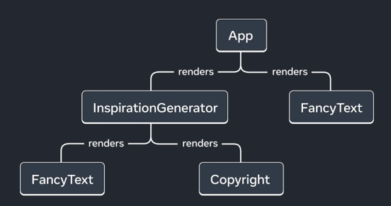

# UI components coding guidelines

> [!IMPORTANT]
> React apps are made out of components. A component is a piece of the UI (user interface) that has its own logic and appearance. A component can be as small as a button, or as large as an entire screen.
> React components are JavaScript functions that return markup
> This document will provide best practices on how to write efficient React components in ClojureScript


At the time of creating the Status app, the Reagent library was a solid choice. Back then, hooks didn't exist, and there weren't any libraries providing effective global state management. After Reagent's emergence, another library called Re-frame built upon Reagent. Together, they offered powerful tools for developing React applications with ClojureScript. However, as React evolved, significant changes occurred. Class components, utilized in Reagent, became deprecated. Instead, functional components and hooks emerged for state management. In Status 2.0, we began incorporating more functional components and hooks, resulting in a blend of both approaches. To simplify matters and reduce confusion, we opted to transition to functional components and hooks for local state management.

BEFORE:
```clojure
(defn- view-internal
  [_ _]
  (let [pressed? (reagent/atom false)]
    (fn
      [{:keys [theme on-press on-long-press icon]}]
      [rn/pressable
       {:style               (style/main @pressed? theme)
        :on-press            on-press
        :on-press-in         #(reset! pressed? true)
        :on-press-out        #(reset! pressed? nil)
        :on-long-press       on-long-press}
       [quo.icons/icon icon]])))

(def view (theme/with-theme view-internal))
```

NOW:
```clojure
(defn view
  [{:keys [on-press on-long-press icon]}]
  (let [[pressed? set-pressed] (rn/use-state false)
        theme                  (theme/use-theme)
        on-press-in            (rn/use-callback #(set-pressed true))
        on-press-out           (rn/use-callback #(set-pressed nil))]
    [rn/pressable
     {:style               (style/main pressed? theme)
      :on-press            on-press
      :on-press-in         on-press-in
      :on-press-out        on-press-out
      :on-long-press       on-long-press}
     [quo.icons/icon icon]]))
```


- We no longer need to create an anonymous function for rendering. This removes unnecessary confusion and the need for specific knowledge on how it works and why it was needed.
- `rn/use-state` is used instead of `reagent/atom`
- State values no longer need to be dereferenced; they are accessible as regular symbols. This eliminates a common bug where the "@" symbol was inadvertently omitted.
- `theme/with-theme` wrapper is not needed anymore, `(theme/use-theme)` hook can be used directly in the components
- `:f>` not needed anymore, all components are functional by default
- `rn/use-callback` hook should be used for anon callback functions

> [!IMPORTANT]
> DO NOT USE anon functions directly in the props
 
BAD
```clojure
(defn view
  []
  (let [[pressed? set-pressed] (rn/use-state false)]
    [rn/pressable
     {:style               (style/main pressed?)
      :on-press-in         #(set-pressed true)
      :on-press-out        #(set-pressed nil)}]))
```

GOOD:
```clojure
(defn view
  []
  (let [[pressed? set-pressed] (rn/use-state false)
        on-press-in            (rn/use-callback #(set-pressed true))
        on-press-out           (rn/use-callback #(set-pressed nil))]
    [rn/pressable
     {:style               (style/main pressed?)
      :on-press-in         on-press-in
      :on-press-out        on-press-out}]))
```

## Global state and subscriptions

For global state management, we utilize Re-frame subscriptions. They can be likened to React state. To obtain the state, `(rf/sub [])` is employed, and to modify it, `(rf/dispatch [])` is utilized. However, they update components in a similar manner to React states.

```clojure
(defn view
  [{:keys [selected-tab]}]
  (let [collectible-list (rf/sub [:wallet/all-collectibles])
        on-collectible-press (rn/use-callback
                              (fn [{:keys [id]}]
                               (rf/dispatch [:wallet/get-collectible-details id])))]
    [rn/view {:style style/container}
     (case selected-tab
       :assets       [assets/view]
       :collectibles [collectibles/view {:collectibles         collectible-list
                                         :on-collectible-press on-collectible-press}])
       [activity/view]]))
```

## Regular atoms

In certain instances, components utilized regular atoms; however, they should now be used with `rn/use-ref-atom`

BEFORE:
```clojure
(defn view
  []
  (let [focused? (atom false)]
    (fn []
      (let [on-clear #(reset! status (if @focused? :active :default))
            on-focus #(reset! focused? true)
            on-blur  #(reset! focused? false)]))))
```

NOW:
```clojure
(defn view
  []
  (let [focused? (rn/use-ref-atom false)
        on-clear (rn/use-callback #(set-status (if @focused? :active :default)))
        on-focus (rn/use-callback #(reset! focused? true))
        on-blur  (rn/use-callback #(reset! focused? false))]))
```

## Effects

LIFECYCLE:

```clojure
(defn view
  [{:keys []}]
  (let [opacity (reanimated/use-shared-value 0)]
    (rn/use-mount #(reanimated/animate opacity 1))
    [rn/view
     {:style (style/opacity opacity)}]))
```

```clojure
(defn view
  [{:keys []}]
  (let []
    (rn/use-unmount #(rn/dispatch [:unmounted]))
    [rn/view]))
```

> [!IMPORTANT]
> Effects should NOT be utilized as a response to state changes for modifying logic. If you're unsure how to achieve this without using effects, please consult the team in the general chat. There may be instances where using effects is appropriate, so we can explore a solution together and enhance our guidelines.

BAD:
```clojure
(defn f-zoom-button
  [{:keys [selected? current-zoom]}]
  (let [size (reanimated/use-shared-value (if selected? 37 25))]
    (rn/use-effect #(reanimated/animate size (if selected? 37 25)) [current-zoom])
    [rn/touchable-opacity
     {:style (style/zoom-button-container size)}]))
```

BAD:

```clojure
(defn view
  [collectible-list (rf/sub [:wallet/all-collectibles])]
  (let []
    (rn/use-effect #(rn/dispatch [:all-collectibles-changed]) [collectible-list])
    [rn/view]))
```

Instead `:all-collectibles-changed` should be used in the handler which changes `collectible-list` state


## Performance tips

To begin with, we need to understand that there are two distinct stages for a component: creation and update. React creates a render tree, a UI tree, composed of the rendered components.



### Component creation

For component creation, the most critical factor is the number of elements involved, so we should strive to minimize them. For instance, it's advisable to avoid using unnecessary wrappers or containers.

BAD:

```clojure
(defn view
  []
  (let []
    [rn/view {:style {:padding-top 20}}
     [quo/button]]))
```

GOOD:
```clojure
(defn view
  []
  (let []
    [quo/button {:container-style {:padding-top 20}}]))
```

### Component updates

For component updates, it's crucial to recognize that React will invoke the function where state is utilized. Therefore, if you utilize state in the root component, React will execute the root function and re-render the entire root component along with all its children (unless optimizations like memoization are implemented).

BAD:

```clojure
(defn component
  [{:keys [label]}]
  (let []
    [rn/text label]))

(defn component2
  [{:keys [label2]}]
  (let []
    [rn/text label2]))

(defn screen
  []
  (let [screen-params (rf/sub [:screen-params])]
    [component screen-params]
    [component1]
    [component2 screen-params]
    [component3]
    [rn/view {:padding-top 20}
     [quo/button]]))
```

Here, we have lost control over the `screen-params` map. It can contain any data, and if any field within this map changes, the entire screen function will be executed, resulting in the re-rendering of both `component` and `component2`.

GOOD:
```clojure
(defn component
  []
  (let [label (rf/sub [:screen-params-label])]
    [rn/text label]))

(defn component2
  []
  (let [label2 (rf/sub [:screen-params-label2])]
    [rn/text label2]))

(defn screen
  []
  (let []
    [component]
    [component1]
    [component2]
    [component3]
    [rn/view {:padding-top 20}
     [quo/button]]))
```

So, now the screen component function will never be invoked, and `component` and `component2` will be re-rendered only when `label` or `label2` have changed.
